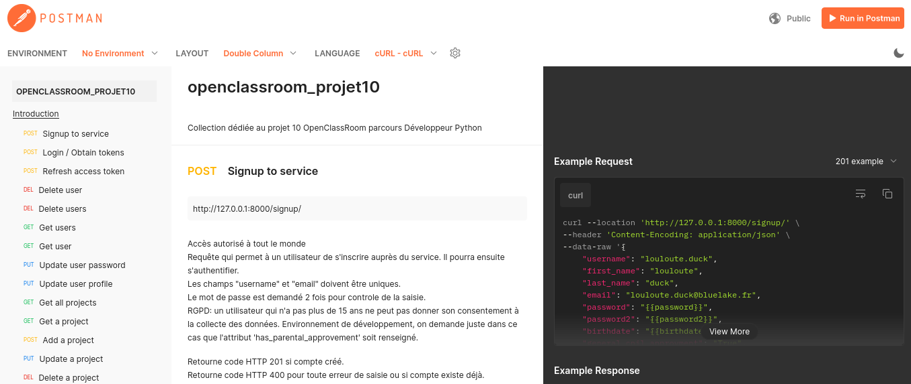

# [OpenClassRoom](https://openclassrooms.com/) - Parcours développeur Python

## Projet 10 - Créer une API sécurisée RESTful en utilisant Django REST

### Project description
    Develop an opened access RESTful API which permits to supervise issues from 4 thematics: front-end, back-end, Android, or iOS.
    For each thematic you create a Project. For each ones, users can create issues and comments (as long as they are part of a project).
    So main features :
          - be able to create projetcs
          - add /remove user(s) from a specific project
          -,allow users to create issues and comments
          - endpoints which allows the dialog with the API

### Requirements
    Introduce all endpoints using Postman
    Quickly describe the code and how you manage to respect OWASP and RGPD guidelines.
    Introduce to a Postmand's API doc.
    Implement a dependency manager, example: pipenv or poetry.

### Competencies assessed
    - Create API RESTful with Django REST.
    - Securing an API with full respect of OWASP and RGPD guidelines.
    - Document an application through Postman.

---

## How works this project ?

    This REST API has a JWT tokens authentication mechanism implemented.
    When you log to the application you will receive 2 tokens: an access one and a refresh one.
    You will have to add the "access token" as a header in all your requests. Postman API documentation is below.

    We set the "access token" with a 15 minutes lifetime validity. You will have to refresh your "access token".
    Procedure to refresh it is describe below (as well in Postman API documentation).
    Notice the application will prompt you when the token has expired.
    The Postman API Doc should answer to any question about the basic usage.

    Pay attention to the 'projects' and issues life cycles.
    A 'project' can have the following status: Open, Archived, Canceled.
    If you DELETE a 'project', as an author, which has no issues : 'project' will have status Canceled.
    If you DELETE a 'project', as an author, which has at least 1 issue : 'project' will have status Archived.

    An issue can have the following status: To Do, In Progress, Finished.

---

## How use this project ?

1. Clone the repository

      `git clone https://github.com/memphis-tools/oc_projet10_rest_framework.git`

      `cd oc_projet10_rest_framework`

2. Setup a virtualenv : 2 possibilities offered here.

   2.1 Legacy (you create your venv, source it and then install project's dependencies)

      `python -m venv env`

      `source env/bin/activate`

      `pip install -U pip`

      `pip install -r requirements.txt`

   2.2 Poetry (you use poetry as a dependencie manager and as a venv builder)

      [https://python-poetry.org/docs/basic-usage/](https://python-poetry.org/docs/basic-usage/)

      This implies that you already have a Python interpreter and download the poetry package on your local machine: `pip install poetry`

      `poetry config cache-dir ./.cache/pypoetry --local`

      `poetry install`

      `poetry update`

      `source $(poetry env info --path)/bin/activate`

3. Start the application : 2 possibilities offered here.

   3.1 Start the application from scratch, run successively

      `python ./manage.py makemigrations`

      `python ./manage.py migrate`

      `python ./manage.py createsuperuser` (and follow instructions)

      `python ./manage.py runserver`

   3.2 Populate a development dummy database and then start the application

   Notice the 3 dummy users username: donald.duck, daisy.duck, loulou.duck. **Default password is:** applepie94

      `python ./manage.py init_app_softdesk`

      `python ./manage.py runserver`

4. Refresh your "access token"

   To refresh, you just need to add a request POST to "token/refresh/" endpoint addressing your "refresh token".

   You will then receive a new "access token". Please follow examples in the Postman API documentation.

6. Read the postman [API documentation](https://documenter.getpostman.com/view/24090419/2s93sc4sWt)

   Illustration

   

   All run in a development environment

   

8. Test the project

    To facilitate tests without updating the ACCESS_TOKEN_LIFETIME in settings file, you can use these instructions.

    The only difference between the main settings.py and the tests_settings.py is the ACCESS_TOKEN_LIFETIME duration.

    You will need first to create a virtual-env (with 'venv' or 'poetry') as describe above.

    `export DJANGO_ENVIRONMENT=TESTS`

    `echo $DJANGO_ENVIRONMENT`

    `python ./manage.py makemigrations`

    `python ./manage.py migrate`

    Before execute any test you should pay attention to the pytest.ini file.

    To execute all the tests: `pytest tests -v`

    To execute specific tests:
    `pytest -v tests/test_users.py`, `pytest -v tests/test_projects.py`, `pytest -v tests/test_issues.py`, `pytest -v tests/test_comments.py`

    Unset the DJANGO_ENVIRONMENT

    `unset DJANGO_ENVIRONMENT`
